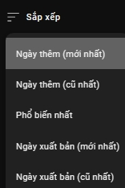
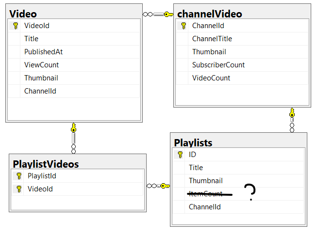

Đảo chiều ngày thêm

Api youtube: https://developers.google.com/youtube/v3/docs/videos#snippet.channelTitle

Thiết kế lại database:

Vì youtube API không thể lấy video bị xóa nên có thể đi theo 2 cách:

Cách 1: Thực hiện yêu cầu lấy playlistvideo lần nữa rồi so sánh trong database 
(tìm hiểu có chế hoạt động của https://text-compare.com/)

Cách 2: Scrape như thường để lấy VideoID của video bị xóa
rồi lấy thông tin chi tiết trong database